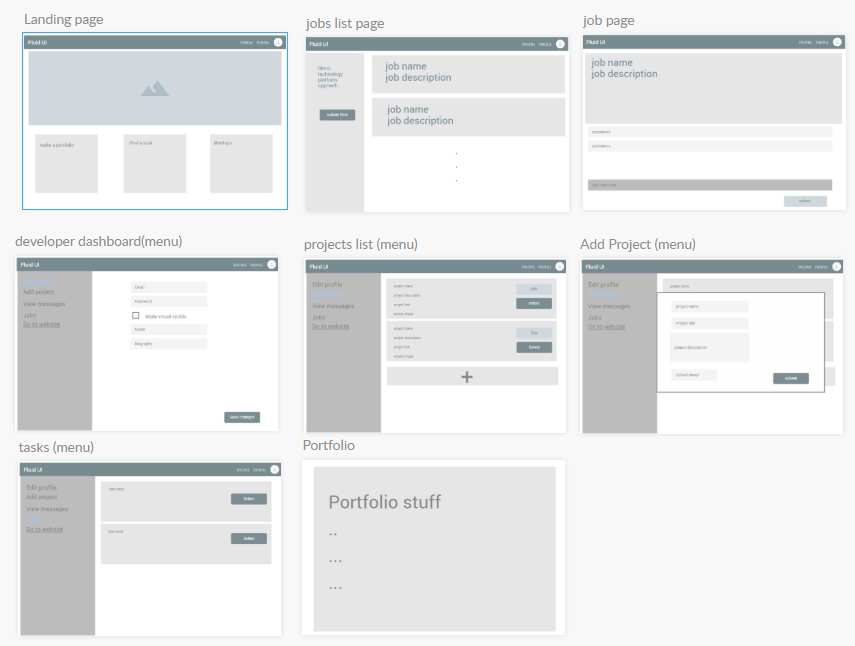

## Project Title

DDW (team member initials)

## Description

DDW is a website that help developer create their own portfolio, share their projects and apply for job postings by employers.

## Technical Used

```
React 
Axios
Firebase
Formik
jsonwebtoken
```

### UI libraries 

```
react compound slider
react-parallax
react-spring 
react-animated-slider
material-ui
react-bootstrap
```

## Wireframe



## User Stories

- As a developer I want to register and login

- As a developer I want to access my portfolio by my username

- As a developer I want to add/edit/delete projects

- As a developer I want to apply for a job

- As an employer I want to create job postings

- As an employer I want to approve the job requests


## Planning and development process

- ##### pre-project week work

  - Brainstormed the main features of the website.
  - Designed the database.
  - Draw the website wireframes.

- ##### project week work (members work)

  - Doaa AlAlawi
    - Employer and developer dashboards
    - Login and register pages
    - Started the chat feature
  - Doaa AlHajjaji
    - Backend schemas and routes
    - Website functionalities
  - Wejdan AlGhamdi
    - User interface 
    - Userinfo schema and routes
    - Add portfolio page

## Future work

- Chat feature
- Meetup page

## Acknowledgments

Thanks to our instructors for providing guidance and help throughout this project. they guided us so positively and they always made us feel confident in our abilities.


